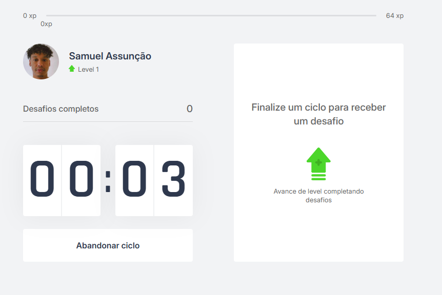
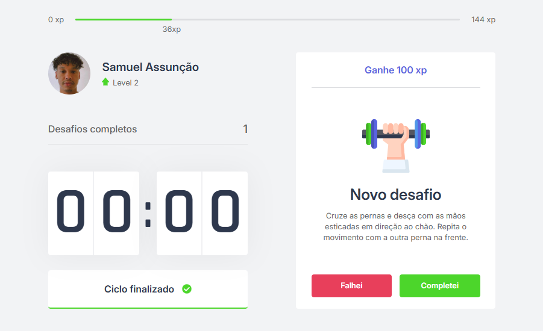
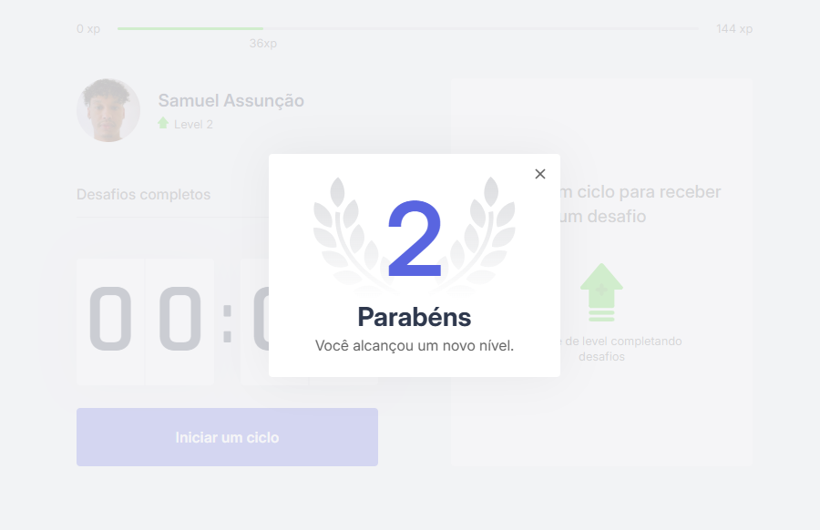

# Moveit


Aplicação web inspirada na técnica **Pomodoro**, desenvolvida durante o evento **Next Level Week (NLW)** da Rocketseat.

O objetivo do projeto é incentivar **pausas ativas durante sessões de estudo ou trabalho**, combinando ciclos de foco com **pequenos desafios físicos** que ajudam a reduzir fadiga e melhorar a produtividade.

---

# Demo

https://moveit-samuel.vercel.app/

Optei por deixar o timer padrão em 6 segundos, para que seja possível visualizar as funcionalidades de forma mais dinâmica na demo.

Futuramente, o usuário poderá escolher o tempo inicial do timer.

# Preview

### Home




### Desafio





### Subindo de nível




# Funcionalidades

- ⏱️ **Timer de foco (Countdown / Pomodoro)**
- 🎯 **Sistema de desafios físicos**
- 📈 **Sistema de experiência e níveis**
- 🔔 **Notificações ao concluir ciclos**
- 💾 **Persistência de progresso com cookies**
- ⚛️ **Gerenciamento global de estado com Context API**

---

# Melhorias implementadas

Além da implementação base do curso, o projeto recebeu algumas melhorias estruturais.

## Refatoração do sistema de timer

A lógica do **Countdown** foi reorganizada para melhorar manutenção e escalabilidade.

Melhorias aplicadas:

- criação de **variável global para o tempo inicial do ciclo**
- centralização da configuração no `CountdownContext`
- simplificação da lógica de controle do timer

Isso facilita:

- alteração do tempo de foco
- reutilização da lógica
- manutenção do código

---

## Melhorias no sistema de notificações

O sistema de notificações foi ajustado para um comportamento mais consistente ao final dos ciclos de foco.

Alterações incluem:

- melhor sincronização com o estado do countdown
- tratamento mais seguro do disparo de notificações

---

# Estrutura do projeto

```md
src
├── components
│ ├── ChallengeBox
│ ├── CompletedChallenges
│ ├── Countdown
│ ├── ExperienceBar
│ └── Profile
│
├── contexts
│ ├── ChallengesContext
│ └── CountdownContext
│
├── pages
│ ├── _app.tsx
│ ├── _document.tsx
│ └── index.tsx
│
└── styles
```


---

# Roadmap (próximas melhorias)

Algumas funcionalidades planejadas para evolução do projeto:

### Sistema de usuário

- autenticação de usuários
- persistência de progresso em conta
- histórico de desafios concluídos

### Personalização de perfil

Planejado no componente `Profile`:

- escolha de **foto de perfil**
- definição de **nome do usuário**
- opção de **avatar cartoon** caso o usuário não queira enviar foto

---

# Tecnologias utilizadas

- React
- Next.js
- TypeScript
- CSS Modules
- Context API

---

# Como rodar o projeto

Clone o repositório:

```bash
git clone https://github.com/samuelassuncao/moveit-next
```

Entre na pasta

```bash
cd moveit-next
```

Instale as dependências:

```bash
yarn
```

Execute o projeto:

```bash
yarn dev
```

A aplicação estará disponível em:

```bash
http://localhost:3000
```

# Aprendizados

Durante o desenvolvimento deste projeto foram praticados conceitos importantes como:

- gerenciamento de estado global com Context API
- organização de projetos em Next.js
- componentização em React
- boas práticas de estruturação de código
- manutenção e refatoração de lógica de estado

---

# Licença

Este projeto está sob a licença **MIT**.
